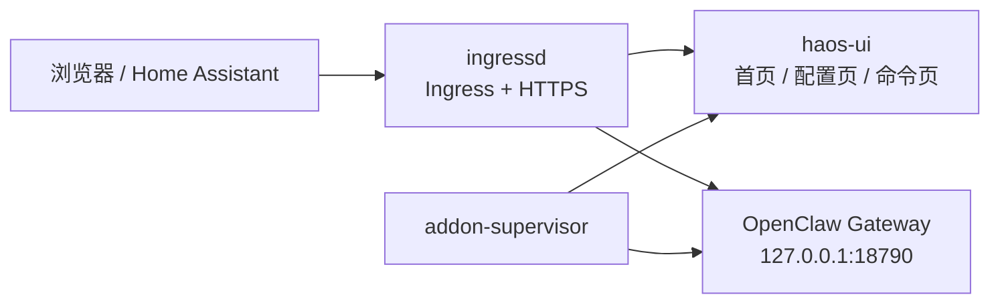
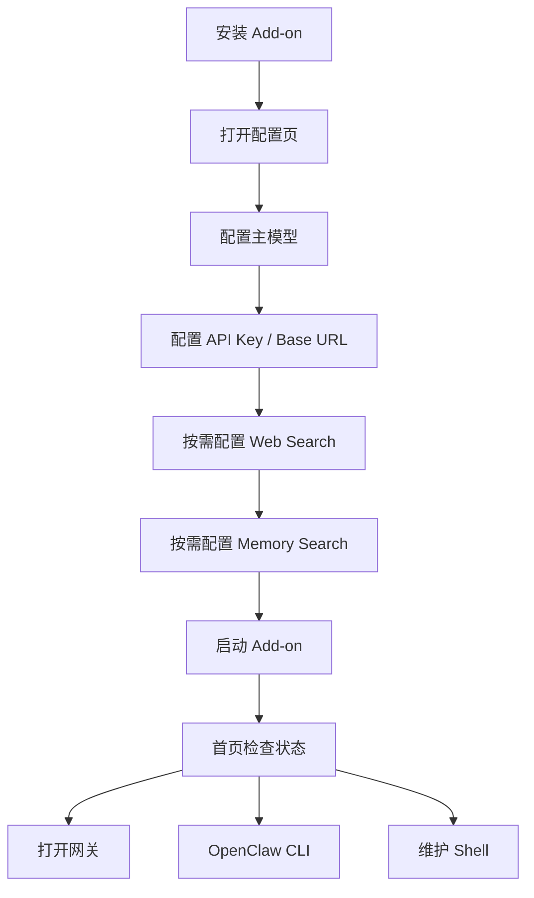

# OpenClawHAOSAddon-Rust 说明文档

## 这个 add-on 做什么

这个 add-on 的目标不是替代 OpenClaw 官方运行时，而是把它接入 HAOS，并保留你在 Home Assistant 环境里最需要的几件事：

- 首页资源采集
- 首页状态显示
- 通过 HTTPS 稳定访问 Gateway
- 通过 Ingress 进入 HA 面板
- 保留原生 TUI 和维护 Shell 入口

## 当前运行结构

## 访问模式说明

当前推荐访问方式如下：

- HA 面板：通过 Ingress 进入
- 外部浏览器：`https://<HA_IP>:18789`
- 内部网关：`127.0.0.1:18790`

说明：

- `18789` 是 add-on 对外提供的 HTTPS 入口
- `18790` 是 add-on 内部的 Gateway loopback 端口
- 这样做是为了满足官方 Control UI 对安全上下文的要求

## 为什么不是直接裸露官方 `18789`

官方 OpenClaw 默认围绕 `127.0.0.1:18789` 工作，但在 HAOS 远程浏览器场景下，Control UI 需要 HTTPS 或 localhost 安全上下文。

因此当前 add-on 采用的是：

- 外部 `https://...:18789`
- 内部 `127.0.0.1:18790`

这不是官方默认拓扑，但它是当前 HAOS 场景下更稳定的适配方式。

## 首页保留了什么

首页仍然保留以下内容：

- 服务与 PID 状态
- Gateway / Ingress / UI 在线状态
- CPU / 内存 / 磁盘 / uptime 等资源采集
- `打开网关`
- `OpenClaw CLI`
- `维护 Shell`

这部分是当前 HA 面板最有价值的内容，所以不会被方案 3 的精简过程拿掉。

## 首次配置路径

## 页面分工

### 首页

负责：

- 运行状态
- 资源采集
- 打开 Gateway
- 打开 CLI / Shell

### 配置页

负责：

- 保存 Web Search 配置
- 保存 Memory Search 配置
- 保存模型配置

不负责：

- 直接做运维动作
- 直接承担初始化和日志排查

保存完成后，请前往命令页或日志页验证。

### 命令页

负责：

- 官方命令参考
- 打开 `OpenClaw CLI`
- 打开 `维护 Shell`
- 初始化、状态检查、doctor 等运维入口

### 日志页

负责：

- 日志相关命令参考
- 打开日志终端
- 打开日志 Shell

## CLI 和 Shell 的区别

### OpenClaw CLI

- 默认进入原生 `openclaw tui`
- 这是更接近官方文档的入口
- 在 TUI 中执行本机命令时，使用 `!命令`

### 维护 Shell

- 直接进入本机 shell
- 更适合传统维护方式
- 不需要 `!` 前缀

## 首次启动行为

首次安装时，add-on 会自动运行一次启动期修复流程，目的是减少第一次安装失败的概率。

后续正常重启默认不会每次都重复执行这一步，因此后续启动通常更快。

## 升级流程

建议按这个顺序做：

1. 更新仓库代码
2. bump `config.yaml` 版本号
3. 重新构建并安装 add-on
4. 检查首页状态
5. 检查 Gateway / CLI / Shell 是否都正常
6. 再确认日志中没有新的回退错误

## 当前已知边界

- `18790` 不是官方默认端口，而是当前 HAOS HTTPS 适配层内部端口
- `Bonjour` 广播日志可能仍会出现，如果你不需要自动发现，可以考虑关闭
- add-on 页面仍然是 HAOS 适配壳，不等于官方原生前端本身

## 相关文档

- 仓库首页：[README.md](./README.md)
- 安装指南：[INSTALL.md](./INSTALL.md)
- 维护上下文：[docs/MAINTAINER_CONTEXT.md](./docs/MAINTAINER_CONTEXT.md)
- 官方 OpenClaw 文档：[docs.openclaw.ai](https://docs.openclaw.ai/)
